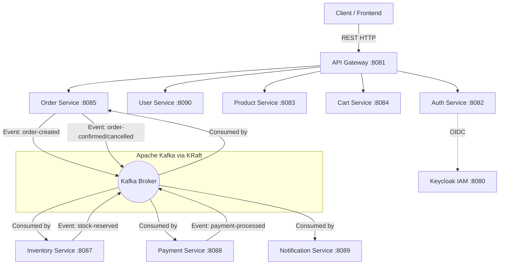

# 🚀 E-Commerce Event-Driven Microservices

    

A highly scalable, reactive, and event-driven E-Commerce platform built purely on **Java 17** and **Quarkus**. It implements the **Saga Pattern** for distributed transactions, utilizing **Apache Kafka** for asynchronous inter-service communication and **Keycloak** for robust centralized IAM (Identity and Access Management).

---

## 🏛️ System Architecture

The ecosystem relies on an API Gateway to handle incoming traffic and enforce JWT validation. Sub-services act independently with their own bounded contexts (Databases) and coordinate complex business transactions (like Checkouts) completely asynchronously.



---

## 🧩 Microservices Breakdown

| Service | Port | Description |
|---|---|---|
| **API Gateway** | `8081` | Serves as the single entry point. Enforces OIDC/JWT restrictions globally. |
| **Auth Service** | `8082` | Proxies user login requests directly to Keycloak to issue Session Tokens. |
| **Product Service** | `8083` | Manages global categories and product catalog listing. |
| **Cart Service** | `8084` | Temporary state storage for user shopping session. |
| **Order Service** | `8085` | Initiates the distributed Saga flow and handles JTA transaction isolation. |
| **User Service** | `8090` | Manages detailed User Profiles extracted and enriched from Keycloak claims. |
| **Inventory Service** | `8087` | Hard stock limits via pessimistic distributed locking and event handling. |
| **Payment Service** | `8088` | Evaluates and tracks payment approvals in the background asynchronously. |
| **Notification Service** | `8089` | Real-time tracking of saga stages and user alerts. |

---

## 🛠️ Technology Stack

- **Framework**: Quarkus (Reactive + Hibernate ORM Panache)
- **Database**: PostgreSQL (auto-migrated via Flyway)
- **Messaging Broker**: Apache Kafka (running in ZooKeeper-less KRaft mode)
- **Security**: Keycloak (OIDC JWT Bearer propagation across internal REST paths)
- **Transmutations**: MapStruct (DTO Mapping)
- **Tooling**: Maven, PowerShell Automation

---

## 🚀 Getting Started

### 1. Prerequisites
- **Java 17+**
- **Apache Maven 3.8+**
- **Docker & Docker Compose** (for backing infrastructure)

### 2. Bootstrapping the Infrastructure
Bring up PostgreSQL, Kafka, and the pre-configured Keycloak instances:
```powershell
docker-compose up -d
```

### 3. Launching Microservices
You can start all 8 microservices smoothly under Quarkus Dev mode via the built-in PowerShell script. The script compiles the core parent libraries and boots isolated Terminal windows automatically.
```powershell
.\run-all-services.ps1
```

---

## 🧪 Automated Testing

We enforce test-driven infrastructure logic using modular PowerShell API wrappers. Wait until all services are booted up before launching tests.

### Run Happy-Path Saga Testing
Executes E2E Order generation, simulating user Auth, Catalog browsing, Cart locking, and Kafka-Saga validations:
```powershell
.\test-all-apis.ps1
```
### Run Comprehensive Microservice Suite
Riot testing across **ALL** 8 microservices, calling CRUD endpoints sequentially to evaluate structural bindings:
```powershell
.\test-comprehensive.ps1
```

---

## 📜 Conventional Commits Workflow

This project enforces strict Git Versioning strategies utilizing [Conventional Commits](https://www.conventionalcommits.org/).

**Type List:**
- `feature`: A new feature
- `bugfix`: A bug fix
- `refactor`: A code change that neither fixes a bug nor adds a feature
- `chore`: Modifying configuration, dependencies or workflow scripts
- `docs`: Documentation only changes
- `style`: Changes that do not affect the meaning of the code (white-space, formatting, etc)

**Example:**
```bash
git commit -m "bugfix(order-service): isolate JTA transactions and fix Arjuna OIDC token propagation"
```
